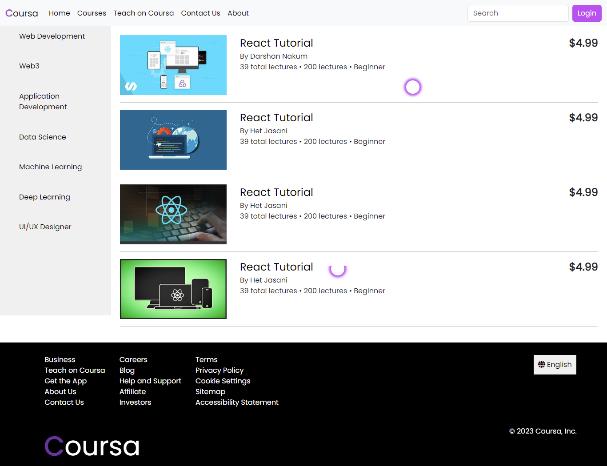
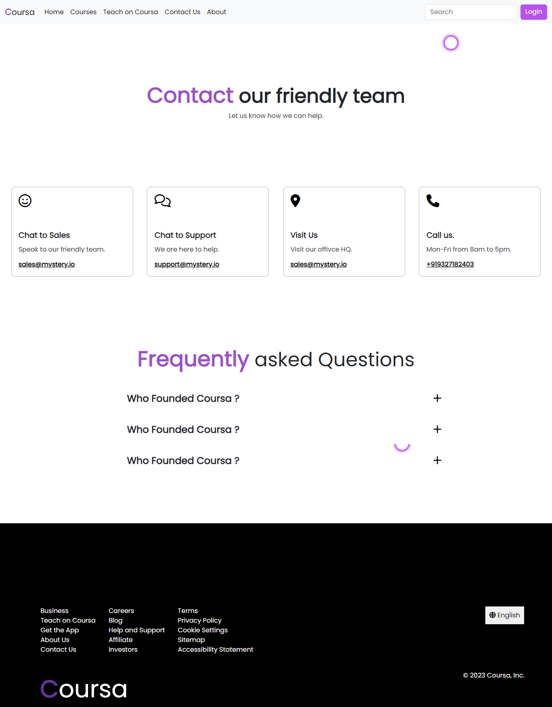
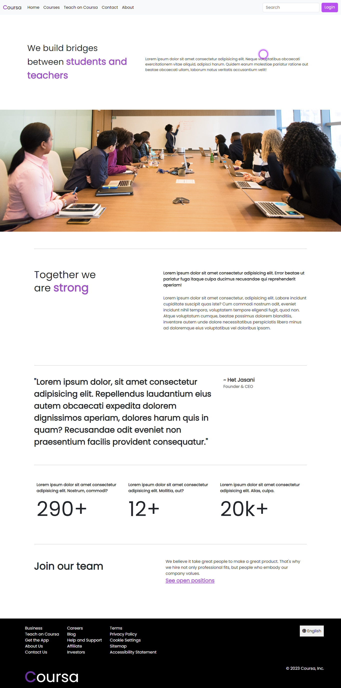
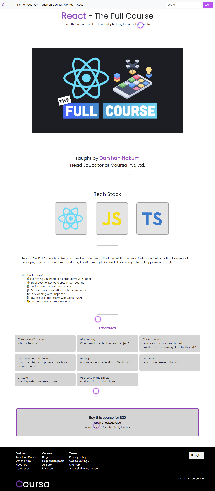

# Coursa
- A learning management system made using HTML and vanilla CSS
- This is my internship task which really took my CSS skills to next level

## Screenshots 
<br>
<br>
<br>
<br>
<br>



## Install the Project
1. First of all I spend more than 3 weeks coding this thing so please star this repository so that I can impress my crush 😁 
2. Clone the repository 
```cmd 
git clone "https://github.com/Hetosk1/Coursa"
```
3. Open the `index.html` file.

